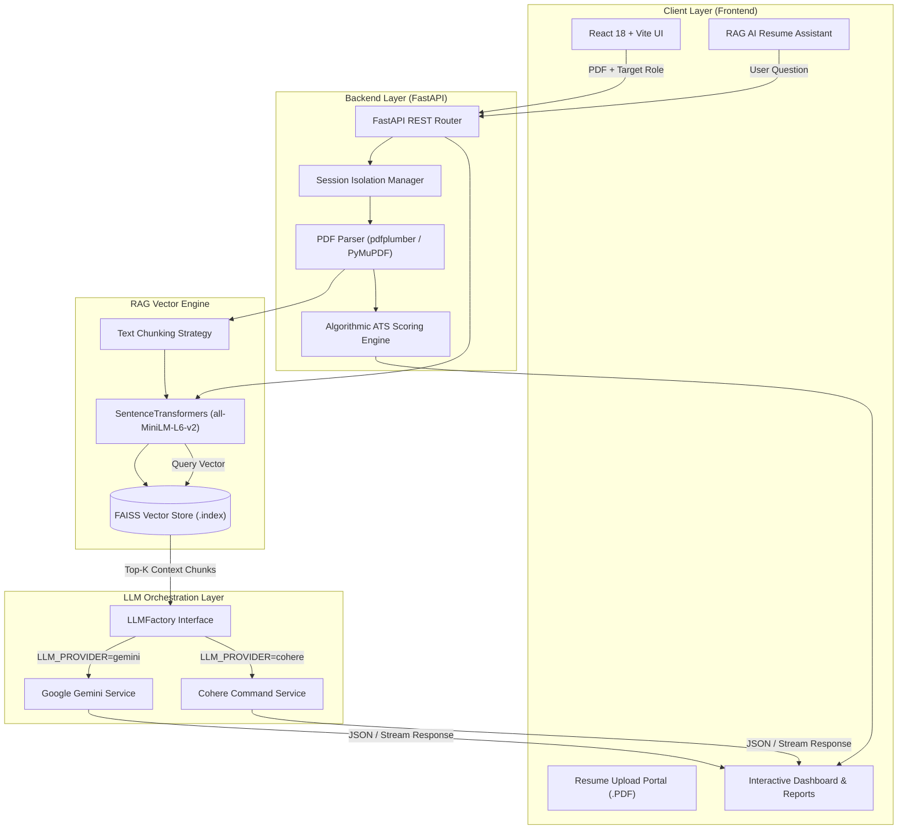
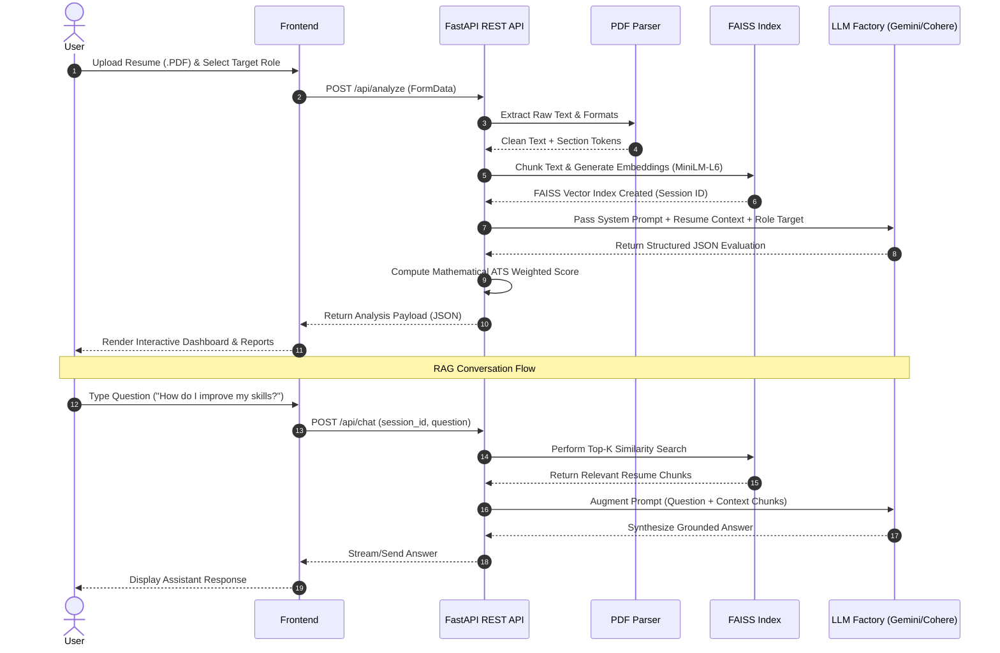

# 🎯 CareerLens AI

<div align="center">

```
  ██████╗ █████╗ ██████╗ ███████╗███╗   ██╗███████╗██████╗  ██████╗  ██████╗███╗   ██╗███████╗
 ██╔════╝██╔══██╗██╔══██╗██╔════╝████╗  ██║██╔════╝██╔══██╗██╔════╝ ██╔════╝████╗  ██║██╔════╝
 ██║     ███████║██████╔╝█████╗  ██╔██╗ ██║█████╗  ██████╔╝██║  ███╗██║     ██╔██╗ ██║███████╗
 ██║     ██╔══██║██╔══██╗██╔══╝  ██║╚██╗██║██╔══╝  ██╔══██╗██║   ██║██║     ██║╚██╗██║╚════██║
 ╚██████╗██║  ██║██║  ██║███████╗██║ ╚████║███████╗██║  ██║╚██████╔╝╚██████╗██║ ╚████║███████║
  ╚═════╝╚═╝  ╚═╝╚═╝  ╚═╝╚══════╝╚═╝  ╚═══╝╚══════╝╚═╝  ╚═╝ ╚═════╝  ╚═════╝╚═╝  ╚═══╝╚══════╝
```

### 🚀 AI-Powered ATS Resume Analysis & Career Intelligence Platform

*Leveraging Retrieval-Augmented Generation (RAG), Semantic Vector Search, and Multi-Provider LLM Orchestration to revolutionize career trajectory optimization.*

---

[](https://opensource.org/licenses/MIT)
[](https://www.python.org/)
[](https://reactjs.org/)
[](https://fastapi.tiangolo.com/)
[](https://vitejs.dev/)
[](https://ai.google.dev/)
[](https://cohere.com/)
[](https://github.com/facebookresearch/faiss)
[](http://makeapullrequest.com)

[Explore Features](#-key-features) • [Architecture](#-architecture-diagram) • [RAG Pipeline](#-rag-pipeline-explanation) • [Quick Start](#-installation-guide) • [API Documentation](#-api-endpoints)

</div>

---

## 📑 Table of Contents

1. [📌 Introduction](#-introduction)
2. [✨ Key Features](#-key-features)
3. [🏗️ Architecture Diagram](#-architecture-diagram)
4. [🖼️ Screenshots & Interface Preview](#️-screenshots--interface-preview)
5. [📁 Folder Structure](#-folder-structure)
6. [💻 Technology Stack](#-technology-stack)
7. [🤖 AI Workflow](#-ai-workflow)
8. [🧠 RAG Pipeline Explanation](#-rag-pipeline-explanation)
9. [⚙️ Installation Guide](#️-installation-guide)
10. [🔑 Environment Variables (.env)](#-environment-variables-env)
11. [⚡ Running Frontend](#-running-frontend)
12. [🔥 Running Backend](#-running-backend)
13. [📡 API Endpoints](#-api-endpoints)
14. [🔮 Future Improvements](#-future-improvements)
15. [🌐 Deployment Guide](#-deployment-guide)
16. [👥 Contributors](#-contributors)
17. [📄 License](#-license)
18. [🙏 Acknowledgements](#-acknowledgements)

---

## 📌 Introduction

In today's competitive hiring landscape, **over 75% of resumes are discarded by Applicant Tracking Systems (ATS)** before reaching a human recruiter. Traditional keyword matchers fail to capture context, nuanced project accomplishments, or semantic skill alignments.

**CareerLens AI** is an open-source, full-stack career intelligence platform built to equalize this dynamic. By combining **Retrieval-Augmented Generation (RAG)**, dense vector embeddings (`SentenceTransformers`), high-speed local indexing (`FAISS`), and dynamic multi-provider LLM orchestration (**Google Gemini** & **Cohere**), CareerLens AI converts standard PDF resumes into actionable executive feedback.

### Why CareerLens AI?
- **Beyond Keyword Matching**: Employs mathematical cosine similarity over dense vector spaces to evaluate candidate competency against targeted job roles.
- **Strictly Grounded RAG Chat**: Context-aware AI assistant that answers questions grounded *only* in candidate resume credentials—preventing hallucinations.
- **Provider Agnostic Architecture**: Seamlessly switch between Google Gemini and Cohere without updating a single line of application code.
- **Privacy First & Lo cal Indexing**: FAISS indices and document chunks are isolated strictly per session UUID, preventing cross-tenant data leaks.

---

## ✨ Key Features

| Feature | Description |
| :--- | :--- |
| 📊 **ATS Compatibility Engine** | Algorithmic scoring evaluating technical skills match (30%), work experience (20%), projects (20%), keyword match (15%), education credentials (10%), and document quality (5%). |
| 🎯 **Skill Gap Identification** | Pinpoints exact technical and soft skills missing from your resume relative to industry benchmarks for your target role. |
| 📋 **Executive AI Reports** | Generates detailed resume strengths, structural weaknesses, formatting feedback, and concrete improvement plans. |
| 🧠 **Interactive RAG AI Assistant** | Ask contextual questions about your uploaded resume (e.g., *"How can I rephrase my project section for a Senior Backend Role?"*) with real-time vector retrieval. |
| 🚀 **Career Roadmaps & Recommendations** | Dynamically recommends high-impact projects, certifications, and skill mastery milestones tailored to your target position. |
| 🔌 **Multi-Provider LLM Factory** | Supports **Google Gemini** (`gemini-2.5-flash`) and **Cohere** (`command-a-03-2025`) via a unified interface (`BaseLLMService`). |
| ⚡ **Local Vector Store (FAISS)** | Local, zero-latency similarity searches using `sentence-transformers/all-MiniLM-L6-v2`. |
| 📄 **Dynamic Report Generation** | Export full ATS reports, interview questions, and career roadmaps directly into downloadable format. |
| 🌌 **Dark Futuristic UI** | Designed with Framer Motion animations, glassmorphism card aesthetics, dynamic timeline loaders, and modern responsive layouts. |

---

## 🏗️ Architecture Diagram

Below is the end-to-end system architecture detailing client interactions, API routing, RAG vector lookup, and LLM synthesis:



---

## 🖼️ Screenshots & Interface Preview

<div align="center">

### 🌌 Main Upload & Role Selection Portal
> *Drag-and-drop PDF resume parser with instant role alignment targeting.*

```
+-----------------------------------------------------------------------------------+
|  [ CareerLens AI ]   Home    Features    Dashboard    Assistant       [ Get Started ]|
+-----------------------------------------------------------------------------------+
|                                                                                   |
|     ✨ Unlock Your True Career Potential with AI-Powered Resume Intelligence     |
|                                                                                   |
|   +---------------------------------------------------------------------------+   |
|   |  📁 Drag and Drop Resume PDF Here                                         |   |
|   |  Target Role: [ Senior Full Stack Engineer                      v ]        |   |
|   |  [ 🚀 Analyze Resume with RAG Engine ]                                   |   |
|   +---------------------------------------------------------------------------+   |
|                                                                                   |
+-----------------------------------------------------------------------------------+
```

### 📊 ATS Compatibility Dashboard & Skill Gap Matrix
> *Real-time breakdown of technical score match, missing competencies, and formatting analysis.*

```
+-----------------------------------------------------------------------------------+
|  ATS Score: 88/100 [===========> ]  | Match Grade: EXCELLENT                      |
+------------------------------------+----------------------------------------------+
| 🟢 Found Skills                    | 🔴 Missing Critical Skills                   |
| • React.js, Node.js, Python        | • Redis, Docker, Kubernetes                  |
| • FastAPI, PostgreSQL, REST APIs   | • CI/CD Pipelines (GitHub Actions)           |
+------------------------------------+----------------------------------------------+
| 🤖 AI Executive Summary:                                                         |
| "Strong backend foundation with excellent API design credentials. Recommended    |
| adding cloud deployment achievements to reach 95+ score threshold."               |
+-----------------------------------------------------------------------------------+
```

</div>

---

## 📁 Folder Structure

```
CareerLensAI/
├── backend/
│   ├── config/              # Centralized environment & RAG configurations
│   ├── knowledge_base/      # Job role requirements database & benchmark schemas
│   ├── logs/                # Rotating runtime loggers and debug outputs
│   ├── prompts/             # Provider-neutral prompt templates (v1 system, ATS, chat)
│   ├── rag/                 # RAG indexing, chunking, and similarity search logic
│   ├── routes/              # FastAPI endpoint controllers (analyze, chat, health, session)
│   ├── schemas/             # Pydantic data validation schemas
│   ├── services/            # BaseLLMService, CohereService, GeminiService, LLMFactory
│   ├── uploads/             # Session file cache (.pdf, parsed text, exported reports)
│   ├── vector_store/        # Session-isolated FAISS indices (.index, .pkl)
│   ├── .env.example         # Template environment variables
│   ├── main.py              # Application entrypoint & CORS middleware setup
│   ├── requirements.txt     # Python dependency lockfile
│   ├── test_cohere.py       # Cohere API diagnostic verification tool
│   ├── test_e2e_migration.py# End-to-end integration test runner
│   └── test_gemini.py       # Gemini API diagnostic verification tool
├── frontend/
│   ├── public/              # Static branding assets and icons
│   ├── src/
│   │   ├── assets/          # SVG graphics and ambient media
│   │   ├── components/      # Modular UI Components
│   │   │   ├── AITimelineLoader.jsx      # Multi-step animated processing screen
│   │   │   ├── ATSScoreCard.jsx          # Score gauges & percentage breakdown
│   │   │   ├── AmbientBackground.jsx     # Dynamic neon blur background canvas
│   │   │   ├── AnalysisDashboard.jsx     # Unified analytics & report view
│   │   │   ├── AnalysisReport.jsx        # Detailed qualitative analysis cards
│   │   │   ├── ExecutiveReportPreview.jsx# Exportable executive summary view
│   │   │   ├── FeaturesSection.jsx       # Landing page feature highlights
│   │   │   ├── Footer.jsx                # Responsive footer with social links
│   │   │   ├── Hero.jsx                  # Hero section with primary CTA
│   │   │   ├── LoadingScreen.jsx         # Initial app loading state
│   │   │   ├── Navbar.jsx                # Glassmorphism header navbar
│   │   │   ├── RecommendedProjects.jsx   # Targeted portfolio recommendations
│   │   │   ├── ResumeAssistant.jsx       # RAG chat component
│   │   │   ├── ResumeQuality.jsx         # Section formatting audit card
│   │   │   ├── ResumeUpload.jsx          # Drag-and-drop dropzone loader
│   │   │   ├── RoleInput.jsx             # Target role dropdown & text input
│   │   │   └── SkillGap.jsx              # Found vs missing skill chip lists
│   │   ├── App.jsx          # Main state machine, tab controller & router
│   │   ├── index.css        # Tailwind CSS directives & global custom styles
│   │   └── main.jsx         # React DOM entrypoint
│   ├── index.html           # HTML5 template & SEO meta tags
│   ├── package.json         # Node.js dependencies and scripts
│   └── vite.config.js       # Vite bundle configuration
├── .gitignore               # System, environment, and cache exclusion file
└── README.md                # Project documentation
```

---

## 💻 Technology Stack

### Frontend Architecture
| Technology | Role |
| :--- | :--- |
|  | Core UI view library with hooks state management |
|  | Next-generation frontend build tooling & HMR |
|  | Utility-first CSS framework for custom styling |
|  | Production-grade physics animations and micro-interactions |
|  | Modern pixel-perfect vector icons |

### Backend Architecture
| Technology | Role |
| :--- | :--- |
|  | Asynchronous Python REST API framework |
|  | Core backend language |
|  | Strict request/response schema validation |
|  | High-speed PDF text & metadata extraction |
|  | Structural table and layout resume parsing |

### AI, ML & Vector Database
| Technology | Role |
| :--- | :--- |
|  | Primary Large Language Model for synthesis |
|  | Alternative LLM provider via Factory interface |
|  | Dense vector embeddings generation |
|  | Local vector store for high-speed similarity retrieval |

---

## 🤖 AI Workflow



---

## 🧠 RAG Pipeline Explanation

Retrieval-Augmented Generation (RAG) ensures that AI outputs are **strictly factual, context-aware, and bound to the user's specific resume context**.

```
+------------------+     +--------------------+     +-------------------+
|  PDF Document    | --> | Text Preprocessing | --> | Sentence Chunking |
|  Upload          |     | & Normalization    |     | (300-500 Tokens)  |
+------------------+     +--------------------+     +-------------------+
                                                              |
                                                              v
+------------------+     +--------------------+     +-------------------+
| Top-K Relevant   | <-- | FAISS Similarity   | <-- | Dense Embedding   |
| Resume Contexts  |     | Search (Cosine)    |     | (all-MiniLM-L6-v2)|
+------------------+     +--------------------+     +-------------------+
         |
         v
+-----------------------------------------------------------------------+
| Prompt Synthesis: System Rules + Retrieved Context + Candidate Query   |
+-----------------------------------------------------------------------+
         |
         v
+-----------------------------------------------------------------------+
| LLM Factory Generation -> Guardrail Validation -> Structured JSON     |
+-----------------------------------------------------------------------+
```

### Technical Step-by-Step:

1. **Document Parsing & Extraction**:
   - Resumes are processed via `pdfplumber` and `PyMuPDF` to extract raw text, headers, and bullet structures.
   - Heuristic normalization strips invisible control characters and normalizes whitespace.

2. **Chunking Strategy**:
   - The parsed resume text is split into semantic chunks of **300–500 tokens** with an overlap of **50 tokens**.
   - Overlapping maintains context continuity across section boundaries (e.g., skill lists spanning experience headers).

3. **Dense Vector Embedding**:
   - Each chunk is embedded into a 384-dimensional vector space using `sentence-transformers/all-MiniLM-L6-v2`.
   - Embeddings run locally on the CPU/GPU with zero external API calls, guaranteeing privacy and low latency.

4. **Session-Isolated FAISS Indexing**:
   - Vectors are added to an in-memory `faiss.IndexFlatIP` (Inner Product / Cosine Similarity) index.
   - Every session receives a dedicated index saved under `backend/vector_store/{session_id}/`, avoiding cross-user index pollution.

5. **Top-K Context Retrieval**:
   - When a user asks a question in the **AI Resume Assistant**, the query is converted into an embedding using the exact same `MiniLM` model.
   - FAISS performs an exact nearest-neighbor search to retrieve the top $K=3$ most relevant chunks.

6. **Augmented LLM Prompting**:
   - Retrieved chunks are injected into a strict system prompt template (`backend/prompts/chat_prompt.py`).
   - The LLM is instructed: *"Answer the user query strictly using the provided context chunks. If the answer cannot be derived from the context, state that explicitly."*

---

## ⚙️ Installation Guide

### Prerequisites
Make sure you have the following software installed on your machine:
- **Node.js**: `v18.0.0` or higher ([Download](https://nodejs.org/))
- **Python**: `v3.10` or higher ([Download](https://www.python.org/))
- **Git**: Latest version ([Download](https://git-scm.com/))
- **API Key**: Either a [Google Gemini API Key](https://aistudio.google.com/) or a [Cohere API Key](https://cohere.com/).

### 1. Clone the Repository
```bash
git clone https://github.com/your-username/CareerLensAI.git
cd CareerLensAI
```

---

## 🔑 Environment Variables (.env)

CareerLens AI utilizes environment variables to manage secret keys, provider configuration, and operational parameters.

### Backend Environment Configuration
Navigate to `backend/` and copy the `.env.example` file:
```bash
cd backend
cp .env.example .env
```

Open `.env` in your code editor and populate the variables:

```env
# ==========================================
# CareerLens AI Backend Configuration
# ==========================================

# Active LLM Provider: 'gemini' or 'cohere'
LLM_PROVIDER=gemini

# Google Gemini Credentials (Used when LLM_PROVIDER=gemini)
GEMINI_API_KEY=your_google_gemini_api_key_here
GEMINI_MODEL=gemini-2.5-flash

# Cohere Credentials (Used when LLM_PROVIDER=cohere)
COHERE_API_KEY=your_cohere_api_key_here
COHERE_MODEL=command-a-03-2025

# RAG & Embedding Settings
EMBEDDING_MODEL=sentence-transformers/all-MiniLM-L6-v2
TOP_K_RETRIEVAL=3

# Server Settings
PORT=8000
HOST=0.0.0.0
CORS_ORIGINS=http://localhost:5173,http://localhost:3000
```

---

## ⚡ Running Frontend

1. Navigate to the `frontend/` directory:
   ```bash
   cd frontend
   ```

2. Install Node modules:
   ```bash
   npm install
   ```

3. Start the Vite React local development server:
   ```bash
   npm run dev
   ```

4. The application will be accessible at:
   ```text
   👉 http://localhost:5173
   ```

---

## 🔥 Running Backend

1. Navigate to the `backend/` directory:
   ```bash
   cd backend
   ```

2. Create a virtual environment:
   ```bash
   # Windows (PowerShell / CMD)
   python -m venv .venv
   .venv\Scripts\activate

   # macOS / Linux
   python3 -m venv .venv
   source .venv/bin/activate
   ```

3. Install required Python packages:
   ```bash
   pip install -r requirements.txt
   ```

4. Verify API credentials (Optional Diagnostic Verification):
   ```bash
   # Test Gemini connectivity
   python test_gemini.py

   # Test Cohere connectivity
   python test_cohere.py
   ```

5. Launch the FastAPI Uvicorn dev server:
   ```bash
   python main.py
   ```

6. The REST backend will start running at:
   ```text
   👉 http://localhost:8000
   ```
   Interactive Swagger API Documentation:
   ```text
   👉 http://localhost:8000/docs
   ```

---

## 📡 API Endpoints

CareerLens AI exposes a structured RESTful API. Key endpoints are documented below:

| Endpoint | Method | Description | Request Payload | Response |
| :--- | :--- | :--- | :--- | :--- |
| `/api/health` | `GET` | System health check & active LLM provider status | None | `200 OK` (JSON) |
| `/api/session/create` | `POST` | Generates a new session UUID and vector store directory | None | `{ "session_id": "uuid" }` |
| `/api/analyze` | `POST` | Uploads PDF resume, extracts text, computes ATS score, and indexes vector embeddings | `multipart/form-data` (file, target_role, session_id) | Analysis JSON Payload |
| `/api/chat` | `POST` | Queries the RAG AI Assistant using vector similarity lookup | `{ "session_id": "...", "message": "..." }` | `{ "reply": "...", "sources": [...] }` |
| `/api/session/report` | `GET` | Retrieves compiled executive analysis report for active session | Query params: `session_id` | Executive Report JSON |

---

## 🔮 Future Improvements

We welcome contributions to help expand CareerLens AI! Here is our planned technical roadmap:

- [ ] **Multi-Resume Comparison**: Side-by-side analysis of multiple resume versions against a single target job description.
- [ ] **Live Job Portal Integration**: Automated scraper/API connections to LinkedIn, Indeed, and Glassdoor for real-time role requirements.
- [ ] **Interactive Resume Builder**: Export optimized LaTeX or HTML/PDF resumes directly from recommended AI fixes.
- [ ] **Voice Interview Simulator**: AI-driven mock audio interview based on identified resume skill gaps using WebSpeech API.
- [ ] **Cloud Vector Storage**: Optional integration with Pinecone / Qdrant for enterprise-scale persistent vector indexing.

---

## 🌐 Deployment Guide

### Deploying Frontend (Vercel / Netlify)
1. Push your repository to GitHub.
2. Import the project into **Vercel** or **Netlify**.
3. Set the root directory to `frontend`.
4. Set build command to `npm run dev` or `npm run build` and output directory to `dist`.
5. Deploy!

### Deploying Backend (Render / Docker / Railway)
A `Dockerfile` can be configured for containerized deployment:

```dockerfile
FROM python:3.10-slim

WORKDIR /app

RUN apt-get update && apt-get install -y \
    build-essential \
    libpoppler-cpp-dev \
    && rm -rf /var/lib/apt/lists/*

COPY requirements.txt .
RUN pip install --no-cache-dir -r requirements.txt

COPY . .

EXPOSE 8000

CMD ["uvicorn", "main:app", "--host", "0.0.0.0", "--port", "8000"]
```

---

## 👥 Contributors

Contributions are what make the open-source community an incredible place to learn, inspire, and create. Any contributions you make are **greatly appreciated**.

1. **Fork the Project**
2. **Create your Feature Branch** (`git checkout -b feature/AmazingFeature`)
3. **Commit your Changes** (`git commit -m 'Add some AmazingFeature'`)
4. **Push to the Branch** (`git push origin feature/AmazingFeature`)
5. **Open a Pull Request**

---

## 📄 License

Distributed under the **MIT License**. See `LICENSE` for more information.

---

## 🙏 Acknowledgements

- [Google Gemini API](https://ai.google.dev/) for state-of-the-art LLM capabilities.
- [Cohere AI](https://cohere.com/) for multi-provider API support.
- [Facebook AI Research (FAISS)](https://github.com/facebookresearch/faiss) for efficient similarity search.
- [HuggingFace SentenceTransformers](https://huggingface.co/sentence-transformers) for dense text embeddings.
- [FastAPI](https://fastapi.tiangolo.com/) for lightning-fast Python API execution.
- [Tailwind CSS](https://tailwindcss.com/) & [Framer Motion](https://www.framer.com/motion/) for modern UI styling and animations.

<div align="center">

---
Made with ❤️ by the **CareerLens AI** Open Source Team.

[⭐ Star us on GitHub](https://github.com/your-username/CareerLensAI)

</div>
# resume_Analyser

